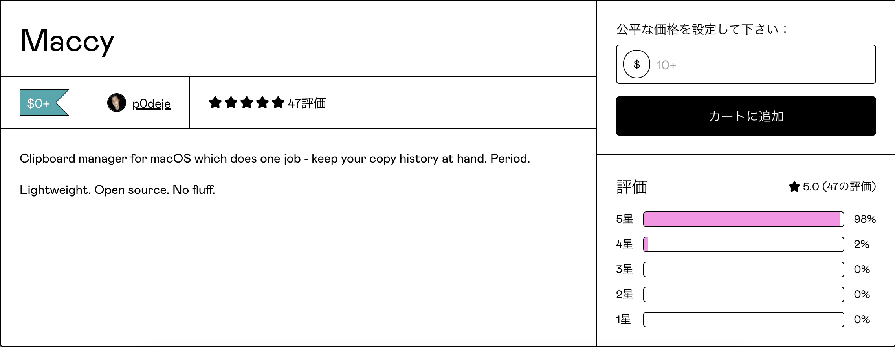
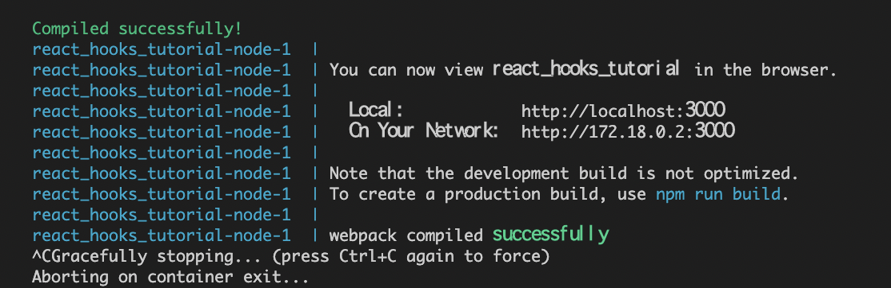
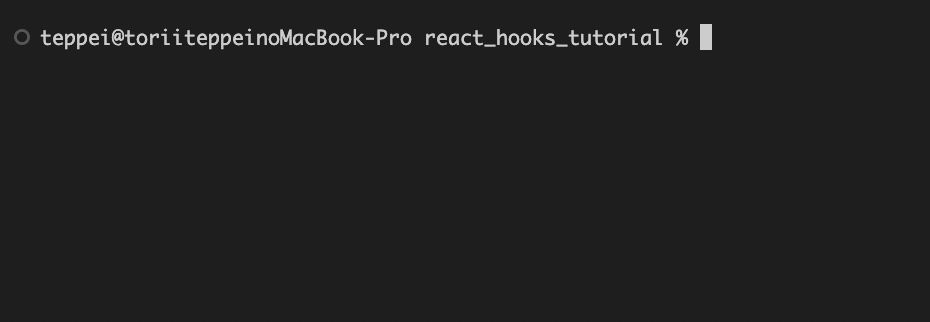
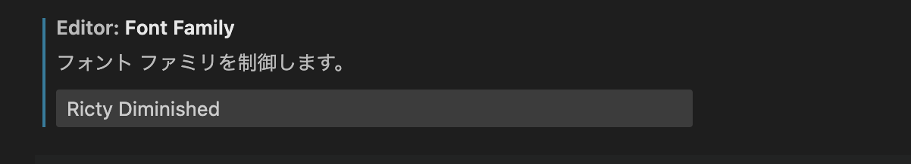
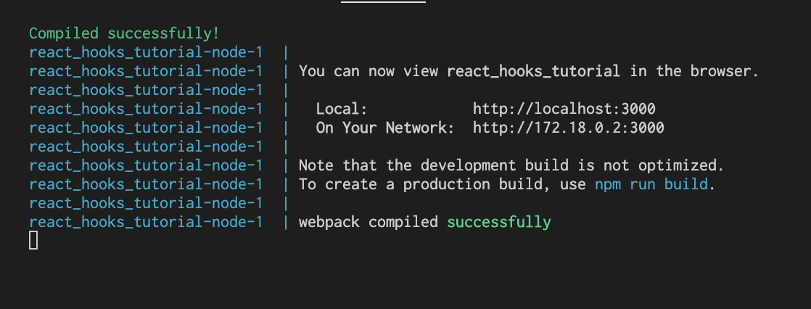
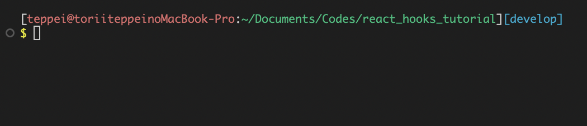

# Intel Mac→M1 Mac移行記録(2023/02/25)

## 移行前のMac

MacBook Pro 13inch(late 2019)

Intel Core i7(8th gen) 4core

RAM: 16GB

SSD: 512GB

USキーボード

## 移行後のMac

MacBook Pro 16inch(2021)

M1 Pro(10core 16GPU)

RAM: 16GB

SSD: 1TB

USキーボード

## 移行にあたって意識したこと

- できる限り以前のMacと同じような環境・使い心地を再現
- ローカル環境を極力汚さない。
    - 移行アシスタントは使用せず、クリーンインストール。
    - アプリ・ツール類はARM対応のものだけをインストール。（Rosetta 2がないと使えないアプリ・ツールはインストールしない。自分の環境がARM対応アプリ・ARM非対応アプリでぐちゃぐちゃになるから）
    - ↑なのでRosetta 2は**絶対に入れない**

## アプリケーション類の導入(開発系以外)

### Chrome

公式サイトから。

特に何も考えずそのままインストールでOK

[https://www.google.com/intl/ja_jp/chrome/](https://www.google.com/intl/ja_jp/chrome/)

### Notion

公式サイトから。

特に何も考えずそのままインストールでOK

[https://www.notion.so/ja-jp](https://www.notion.so/ja-jp)

### Trello

App Storeからダウンロード。

### Slack

App Storeからダウンロード。

### Chatwork

公式サイトから。

[https://go.chatwork.com/ja/download/](https://go.chatwork.com/ja/download/)

Mac版をダウンロード。

### LINE

App Storeからダウンロード。

### Zoom

[https://zoom.us/download](https://zoom.us/download)

`Apple Silicon搭載したMacの場合は、こちらをクリックしてください`という表記がある。

「こちら」の部分がダウンロードのリンクになっているので、クリックしてダウンロード。

### DeepL

公式サイトから。

[https://www.deepl.com/ja/app/](https://www.deepl.com/ja/app/)

`Macにダウンロード` をクリックしてダウンロード。

ボタンの下に「MacOS 11以降に対応」という表記がある。

### Gyazo

公式サイトから。

[https://gyazo.com/download](https://gyazo.com/download)

Gyazo Gif はお好みで。

### Cyberduck

公式サイトから。

[https://cyberduck.io/download/](https://cyberduck.io/download/)

`Cyberduck for MacOS` をクリックしてダウンロード

### Maccy（Clipyの代替）

ClipyがM1 Macに対応していないので、代わりのクリップボードツールとして選定。

（クリップボードツール = コピーしたテキストの履歴を保持し、履歴からコピペができるツール）

ダウンロードは公式サイトから。

[https://maccy.app/](https://maccy.app/)

Download now をクリックしてダウンロード。（App Storeでもダウンロードできるが有料）

ボタンをクリックすると以下のようなモーダルが出現する。



$0でもダウンロードできるので、無料で欲しければ0を入力してカートに追加、ダウンロード。

## 開発環境構築

技術ブログ等要約されている記事を見た上で、公式の手順に従ってインストール。

### VSCode(&ターミナル)

[https://code.visualstudio.com/](https://code.visualstudio.com/)

Universal もしくは Apple Silicon をインストール（自分はApple Siliconにした）

フォントの修正と、ターミナルを見やすくするために（例：現在のブランチを常に把握しておけるようにする・・・等）設定をカスタマイズ。

### **Before**





### ターミナルを見やすくする

現在のGitのブランチと、プロンプトを改行して表示させる

さらに、ユーザー:ディレクトリ:ブランチの形で文字に色をつけ、ブランチの部分に関しては「変更なし」「変更あり・ステージングしていない」「変更あり・ステージング済」に応じて色が切り替わるようにする

viエディタで `.zshrc`を編集する。

```bash
vi ~/.zshrc
```

```bash
# 以下の記述を追加

# 変更・ステージング状況に応じたブランチ表示部分の色切り替え（デフォルトはシアン色）
autoload -Uz vcs_info
setopt prompt_subst
zstyle ':vcs_info:git:*' check-for-changes true
zstyle ':vcs_info:git:*' stagedstr "%F{magenta}!"
zstyle ':vcs_info:git:*' unstagedstr "%F{yellow}+"
zstyle ':vcs_info:*' formats "%F{cyan}%c%u[%b]%f"
zstyle ':vcs_info:*' actionformats '[%b|%a]'
precmd () { vcs_info }

# ユーザー:赤 ディレクトリ:緑 ブランチ: シアン
# プロンプトは % → $ に変更し、改行して黄色で表示
PROMPT='
[%F{red}%n@%m%f%b:%F{green}%~%f]%F{cyan}$vcs_info_msg_0_%f
%F{yellow}$%f '
```

色はお好みで。

### フォントを変更する

プログラミング用フォント Ricty Diminished をインストール。

[https://github.com/edihbrandon/RictyDiminished](https://github.com/edihbrandon/RictyDiminished)

Download ZIP → Ricty Diminished Regular.ttfを開く→インストールボタンをクリック

これでMacのフォントにRicty Diminishedが登録される。

次にVSCodeのフォントに設定する。

設定 の Editor: Font Family にRicty Diminished を記述



前のデバイスと同期していて、既にRicty Diminishedの記述があれば、フォントのインストールだけでOK。

### **After**





### Docker

[https://www.docker.com/](https://www.docker.com/)

Apple Chipを選択、インストール。

前のMacで作ったコンテナ・イメージは引き継がれていないが、 `docker-compose up` すればちゃんとコンテナ・イメージが作成されるので心配無用。

### Figma

[https://www.figma.com/ja/downloads/](https://www.figma.com/ja/downloads/)

macOS用デスクトップアプリを選択、インストール。

今後、サイトを作る際のワイヤー作りで使う。

### DBeaver

[https://dbeaver.io/download/](https://dbeaver.io/download/)

MacOS for Apple Silicon を選択、インストール。

前に使っていたMacには、MySQL Workbench, Sequel Ace, DBeaverの3つがインストールされていた。

そんなにいらんやろというのと、DBeaverならMySQL以外のRDBMS(SQLiteとかPostgresql)にも対応しているので、大は小を兼ねるって感じでDBeaver一択に絞ることとした。

### Homebrew

公式

[https://brew.sh/index_ja](https://brew.sh/index_ja)

インストールに関する参照記事

[https://original-game.com/how-to-install-homebrew/](https://original-game.com/how-to-install-homebrew/)

PATHを通すコマンドが記事と異なり、自分は以下のコマンドだった

```bash
(echo; echo 'eval "$(/opt/homebrew/bin/brew shellenv)"') >> /Users/username/.zprofile
    eval "$(/opt/homebrew/bin/brew shellenv)"
```

### Git

Hombrewのインストールに含まれる。

### Git: ユーザー・メールアドレス登録

```bash
git config --global user.name "ユーザー名"
git config --global user.email メールアドレス
```

### Git: SSHキー設定

```bash

# GitHubに登録しているメールアドレスでSSH keyを生成
$ ssh-keygen -t rsa -C hoge@example.com

# 以下の事が聞かれるので、特に設定しなければならない場合を除き『Enter』キーを入力して進む。
Enter file in which to save the key (~/.ssh/id_rsa):
Enter passphrase (empty for no passphrase):

$ ls ~/.ssh

# 以下2つのファイルが存在していたらOK。
id_rsa
id_rsa.pub

# Githubにログイン,SSH key新規作成画面へ。
Settings > SSH and GPG keys > New SSH keys

# id_rsa.pub(秘密鍵ファイル)の内容を表示
$ less ~/.ssh/id_rsa.pub

↑英数字の羅列が表示されるので、メールアドレス前までを全てコピー。
New SSH keysの設定画面内のKeyへペースト > Add SSH Keyをクリック。

# configファイルを開き、SSH接続用にホストを設定する
$ vi ~/.ssh/config

# Viエディタで以下を入力。(iで入力、escで入力解除、:wqで保存してviエディタから退出)
Host github
  HostName github.com
  IdentityFile ~/.ssh/id_rsa
  User git

# SSH接続できているか確認
$ ssh -T git@github.com

# 下記のメッセージが表示されればSSH接続成功
Hi 『ユーザー名』! You've successfully authenticated, but GitHub does not provide shell access.
```

### Volta

[https://volta.sh/](https://volta.sh/)

Node.jsのバージョン管理ツール。当初は無難にNodebrewをインストールしようと思っていたが、

Nodebrewとの比較やVoltaのメリットから、Voltaを使うことに決めた。

```bash
# Voltaの特徴・できること
動作が高速
プロジェクト単位でNodeのバージョン切り替えができる
プロジェクト作成者はNodeのバージョンを固定できる
（=共同作業者のNodeのバージョンが違っても、固定されたNodeのバージョンの環境下で作業できる）
MacはもちろんWindowsでも使える
新しめのツールなので日本語の情報は少なめ
```

Homebrew経由でもインストールできるが・・・

調べてみた所感、おすすめはされていないようなのでVolta公式の手順に従ってインストールすることをおすすめする。

### Node.js

Voltaでインストール。

```bash
volta install node
success: installed and set node@18.14.2 (with npm@9.5.0) as default
```

こちらのコマンドを実行することで、NodeのLTS版と、npmが一緒にインストールされる。

### clasp

[https://github.com/google/clasp](https://github.com/google/clasp)

GASのCLIツール。VSCodeでGASのコードのpush,pull,cloneができるようになる。

### そのほかの設定

- Pro Motion(ディスプレイのリフレッシュレートが120hzになる機能)はオフ。
    - 省電力のため。
- Caps lockで日本語入力・英語入力切り替え

## 導入しなかったツール・アプリ

### Kindle

ARMに対応しておらず、インストールするならRosetta 2が必要。

マジかよAmazon😭

### Clipy

Kindleと同様の理由。

開発が止まっていて、Apple Silicon対応の目処はなさそう・・・。

Clipyが使えないので、代替としてMaccyをインストールした。

### iTerm2

VSCode上でターミナルを起動して使う機会の方が多かったので、一旦インストールしない方向で。

不便さを感じてきたらインストールする。

### Karabiner-Elements

左右のCommandキーで日本語入力と英語入力の切り替えをするために導入していたが、Caps lockキーで同じことができるのでお役御免。

### Swagger

前のMacでは入れてはいたけどそこまで出番なかったので一旦インストールしない方向で。

とは考えているが、実務で使った広告API(Facebookとか)の備忘ドキュメントを作るために使うのもアリかなと思っているので、後々インストールすると思う。

### Postman

Swaggerと同様。こちらも同じく後々インストールすると思う。

## 移行を終えて

Apple SiliconのMacが出て今年で3年ということで、当初よりも対応アプリ・ツールが増えてきているし、Intel Mackからの移行に関する記事・環境構築に関する記事類が充実していたこともあり、特段ハマるポイントはなかった。先人たちに感謝🙏